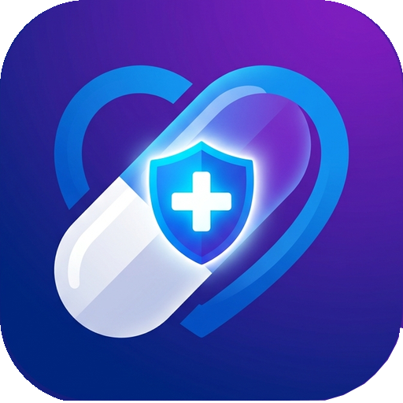

<h1 align="center">
   Curalis
</h1>

<p align="center">
  
  
  
  
  
  
  
  
</p>

<p align="center">
  
</p>

**Curalis** is a privacy-first, local-first intelligent medication and personal health tracking application built for Android. 
Designed with a seamless and modern UI using **Jetpack Compose** and **Material 3**, Curalis helps users organize medications, smart reminders, doctors, appointments, and vitals with 100% offline privacy and zero unnecessary data collection.

---

## 🚀 Key Highlights & Documentation
For full architectural details, developer documentation, and engineering guidelines, please see the [Documentation Index](docs/index.md).
*(Mimari detaylar, geliştirici dokümanları ve mühendislik prensipleri için lütfen [Dokümantasyon](docs/index.md) dizinine göz atın.)*

See [CHANGELOG.md](CHANGELOG.md) for what's new in each release.

---

## ✨ Features

- ⏰ **Smart Medication & Alarm Engine:**
  - Exact alarms with full-screen intent, custom sounds, vibration, and snooze support (`AlarmManager`).
  - Flexible scheduling: Daily, Specific Days, Intervals (Every X days), and As-Needed (PRN quick dose logging).
  - Meal instructions (Before, After, With meal) and customized medication forms/colors.

- 🇹🇷 **Offline TİTCK Drug Dictionary:**
  - Bundled with ~23,000 official Turkish Medicines and Medical Devices Agency (TİTCK) medications.
  - Lightning-fast offline searching by trade name and active ingredient with barcode support.

- 🗓️ **Virtual Timeline & Adherence Calendar:**
  - Dynamic "Virtual Schedule Generator" calculates unlimited future schedule occurrences without bloating the database.
  - Interactive daily timeline and monthly adherence tracking with compliance rates.

- 👨‍⚕️ **Health & Appointment Ecosystem:**
  - **Doctors:** Manage doctors with specialties, phone, email, and clinical notes.
  - **Appointments:** Schedule medical visits with reminder alarms and notes.
  - **Vitals Tracking:** Track blood pressure, blood glucose, weight, temperature, pulse, and oxygen saturation.

- 📄 **PDF Health & Doctor Report:**
  - One-tap export to a comprehensive, professional PDF health report (active medications, dosage schedule, treatment history, and adherence statistics) to share with healthcare providers.

- 📦 **Inventory & Refill Alerts:**
  - Track remaining pills and stock automatically decremented on dose taken.
  - Customizable refill warning thresholds.

- 🔒 **Privacy & Local-First Backup:**
  - 100% offline-ready Room database.
  - Optional encrypted Google Drive backup and local JSON export/import.

---

## 🏛️ Architecture & Tech Stack

Curalis strictly follows **Clean Architecture** and **MVI / MVVM** patterns:

```text
UI (Jetpack Compose / Material 3)
      │
      ▼
ViewModel (StateFlow & SharedFlow)
      │
      ▼
Domain Layer (Use Cases & Business Logic)
      │
      ▼
Repository Layer
 ┌────┴──────────────────────────┐
 ▼                               ▼
Local Room Database       TİTCK Drug Dictionary (Pre-packaged SQLite)
```

- **Language & Runtime:** Kotlin (Coroutines, Flow)
- **UI Framework:** Jetpack Compose, Material Design 3, Dynamic Color
- **Dependency Injection:** Dagger Hilt
- **Local Storage:** Room Database, Encrypted DataStore
- **PDF Engine:** iText 7
- **Scheduling:** AlarmManager & WorkManager
- **Backup & Cloud:** Google Drive REST API (Optional)

---

## 🛠️ Build & Setup

### Requirements
- **JDK:** 17+
- **Android SDK:** Compile SDK 35, Min SDK 26
- **Tooling:** Antigravity IDE / Gradle CLI

### Build Commands
```bash
# Clone the repository
git clone git@github.com:gokcank/Curalis.git
cd Curalis

# Build debug APK
./gradlew assembleDebug

# Install on connected device / emulator
./gradlew installDebug
```

---

## 🔒 Privacy & Medical Disclaimer

- **Privacy First:** Curalis does not collect, track, or sell your health data. All data remains strictly on your local device unless you choose to use the optional cloud backup.
- **Medical Disclaimer:** Curalis is **not** a medical device and does not provide medical advice, diagnosis, or treatment recommendations. Always consult a healthcare professional regarding your medications and health conditions.

---

## 📄 License & Attribution

All rights reserved. Proprietary software developed with privacy-centric engineering.
